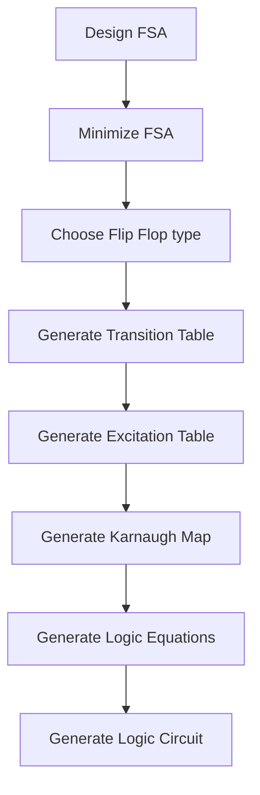

# Sequential Machine Synthesizer (SMS)

## Goal

The goal of this project is to create a tool from scratch that can help the user to synthesize a sequential machine from a given specification e.g. a set of input/output sequences. The tool will be accessible via a web interface.

## Project Structure

