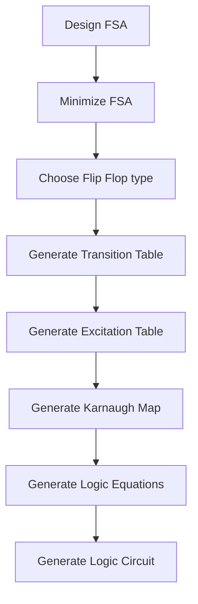
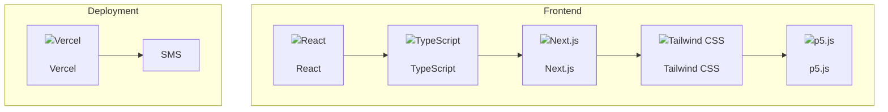

# Sequential Machine Synthesizer (SMS)

## Goal

The goal of this project is to create a tool from scratch that can help the user to synthesize a sequential machine from a given specification e.g. a set of input/output sequences. The tool will be accessible via a web interface.

## Project Structure

## Development Plan

### 0. Choose the technology stack

- **Frontend Framework:** [React](https://reactjs.org/) (with TypeScript)
- **Backend Framework:** [Next.js](https://nextjs.org/)
- **CSS Framework:** [Tailwind CSS](https://tailwindcss.com/)
- **Graphics Library:** [p5.js](https://p5js.org/)
- **Deployment:** [Vercel](https://vercel.com/)

